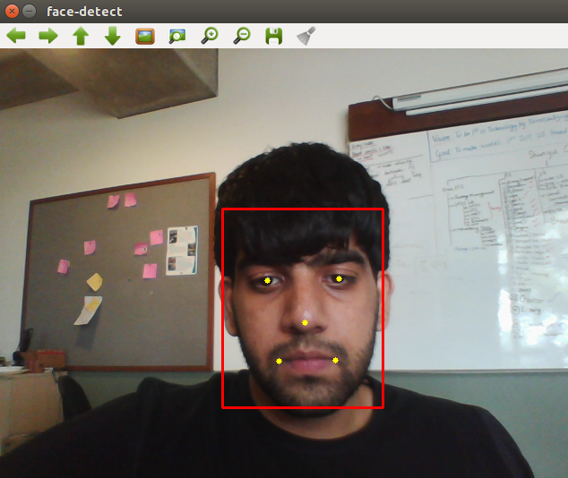

# Shunyaface Library
Updates : Project documentation(beta) is on  https://shunyaos.github.io/shunyaface/

**ImportantNote:** `Following instructions are old and deprecated, it will be updated before 20th October 2020.`

----------
-------

Restrictions on usage is relaxed it will work for few months for you . When you are sure and want to use it in a product .Please raise an issue .

> Shunyaface is a face Detection/Recognition Library which simplifies face detection/recognition on devices which support Shunya OS. 

It is written in C++. This library was created after studying the best features of **MTCNN,Dlib,Opencv**.

Some layers of MTCNN were replaced with new techniques to get faster results. To make it faster ,it uses a **custom OS -Shunya** which is optimised for AI libraries .

## Table of contents
* [General info](#general-info)
* [Screenshots](#screenshots)
* [Features](#features)
* [Wiki](#wiki)
* [Status](#status)
* [Contact](#contact)

## General info

The project aims to achieve fastest detection and recognition speed with low power hardware. 
Shunyaface is written for embedded-devices like RPI-4,RPI-3,Hikey970,etc and uses Shunyaos.
Currently the library **achieves a detection FPS of 16-17 FPS on the RaspberryPi-4**. 

This Library is a trial edition and will support detection/recognition for atleast 3 months (it uses a different method to determine if user has had enough trials of the code)

## Screenshots

## Features

* Face Detection
* Face Recognition
* Database Handling for faces

## Wiki

If you want to try it yourself go [here](https://github.com/shunyaos/shunyaface/wiki)

## Status
Project is: **_in progress_**. We will be constantly updating the project so as to improve speed as well as accuracy of face recognition and detection. 

## Contact
Created by [@shunyaos](http://shunyaos.org/). If you are insterested in buying or for any support or queries feel free to email me at support@shunyaos.org
